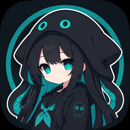
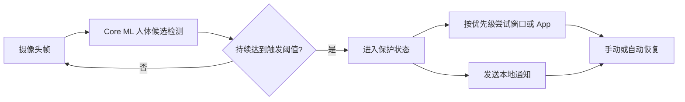

<p align="center">
  
</p>

<h1 align="center">大墨鱼（Moyu Pro）</h1>

<p align="center">
  本地运行的 macOS 菜单栏隐私辅助工具
</p>

<p align="center">
  <a href="https://github.com/LingLambda/moyu-plus/actions/workflows/ci.yml"></a>
  <a href="https://github.com/LingLambda/moyu-plus/releases"></a>
  
  
  <a href="LICENSE"></a>
</p>

<p align="center">
  简体中文 · <a href="README_EN.md">English</a>
</p>

大墨鱼通过摄像头和 Core ML 在本机检测画面中的通用人体候选。当人数持续达到设定阈值时，它可以按优先级切换到指定窗口、激活指定 App，并发送自定义本地通知。

摄像头画面只在内存中处理，不上传、不录像，也不进行人脸或身份识别。

> [!IMPORTANT]
> 大墨鱼只能提供环境变化提示，不能替代门锁、屏幕锁、访问控制等安全措施，也不应被用于监控他人。

## 特性

- **完全本地运行**：使用 Vision 与 Core ML 执行人体候选检测，不依赖网络服务。
- **可调检测规则**：支持触发人数、恢复人数、确认时间、恢复延迟、置信度和最小目标面积配置。
- **四个动作目标**：可独立配置 `窗口 1`、`窗口 2`、`App 1`、`App 2`，并自由调整执行优先级。
- **可靠的动作回退**：未配置或不可用的目标会被跳过；App 启动失败后继续尝试下一个目标。
- **多种窗口跟踪方式**：支持窗口 ID 优先、严格窗口 ID 和完整标题匹配。
- **当前 Space 约束**：窗口目标只匹配当前 Space 中可见且可操作的窗口；App 目标可以跨 Space 激活或启动。
- **本地通知**：支持自定义通知标题与正文，也可独立发送测试通知。
- **运行状态控制**：支持手动恢复、自动恢复、摄像头选择、实时预览和登录时启动。
- **资源按需使用**：暂停或退出保护后停止摄像头采集与模型推理。

## 工作方式



所有视觉数据处理都发生在本机内存中。应用会保留运行配置、累计保护次数和本地轮转诊断日志，但不保存摄像头帧或检测历史。

## 系统要求

| 项目 | 要求 |
| --- | --- |
| 操作系统 | macOS 14.0 或更高版本 |
| 处理器 | Apple Silicon 或 Intel（发布构建为 universal binary） |
| 源码构建 | Xcode 26 或兼容版本、Swift 6、XcodeGen |
| 模型工具 | Python 3.12 与 `uv`，仅模型导出和基准测试需要 |

## 安装

### 下载 DMG

1. 从 [Releases](https://github.com/LingLambda/moyu-plus/releases) 下载最新的 DMG。
2. 打开 DMG，将“大墨鱼”拖入“应用程序”。
3. 从“应用程序”目录启动大墨鱼，并按引导授予所需权限。

> [!WARNING]
> 当前自动发布流程生成的是 ad-hoc 签名且未公证的 DMG，主要用于测试。正式跨 Mac 分发仍需配置 Developer ID 签名和 Apple 公证。

### 从源码构建

```bash
brew install xcodegen
git clone https://github.com/LingLambda/moyu-plus.git
cd moyu-plus
xcodegen generate
xcodebuild \
  -project MoyuPro.xcodeproj \
  -scheme MoyuPro \
  -configuration Debug \
  -destination 'platform=macOS' \
  -derivedDataPath build/DerivedData \
  build
open build/DerivedData/Build/Products/Debug/MoyuPro.app
```

## 快速开始

1. 首次启动时允许摄像头权限；通知权限按需开启。
2. 打开“触发动作”，启用“触发时执行窗口/App 动作”。
3. 在“辅助功能权限”中打开系统设置，并允许当前安装的大墨鱼。
4. 返回应用并刷新当前 Space 中的窗口列表。
5. 配置 `窗口 1`、`窗口 2`、`App 1` 和 `App 2`，再调整动作优先级。
6. 点击“测试切换”，确认窗口或 App 动作符合预期。
7. 调整检测规则并启用保护。

最小化窗口和其他 Space 中的窗口不会出现在窗口列表中。测试 DMG 安装版本时，请避免同时运行 Xcode 构建的另一个大墨鱼实例。

## 动作与窗口匹配

触发后，大墨鱼按用户配置的顺序依次尝试四个目标。未配置、重复或不可用的目标会被跳过；任一动作成功后停止继续执行。

| 目标 | 行为 |
| --- | --- |
| 窗口 1 / 窗口 2 | 在当前 Space 中定位并聚焦指定窗口 |
| App 1 / App 2 | 激活已运行的 App，或启动未运行的 App；可跨 Space |

窗口目标支持三种跟踪方式：

| 模式 | 行为 | 适用场景 |
| --- | --- | --- |
| 自动跟踪（ID 优先） | 优先匹配窗口 ID；ID 失效后仅在标题候选唯一时回退 | 推荐的默认模式 |
| 严格窗口 ID | 只匹配保存的窗口 ID | 同标题窗口较多，且不希望发生标题回退 |
| 仅匹配标题 | 匹配完整窗口标题 | App 不提供稳定窗口 ID，且标题可预测 |

macOS 的窗口 ID 只在窗口生命周期内有效。窗口关闭、重建或 App 重启后，可能需要重新选择目标。

## 权限说明

| 权限 | 用途 | 未授权时 |
| --- | --- | --- |
| 摄像头 | 在内存中执行人体候选检测 | 无法启用保护 |
| 通知 | 发送自定义本地通知 | 检测与窗口/App 动作仍可运行 |
| 辅助功能 | 枚举、聚焦和置前精确窗口 | 窗口动作不可用，App 动作和通知仍可运行 |
| 登录项 | 登录后自动启动菜单栏应用 | 仅影响自动启动 |

窗口切换依赖 macOS Accessibility Server，因此应用不启用 App Sandbox。Hardened Runtime 构建仍保留摄像头 entitlement，用户也必须在系统设置中明确授权。

## 开发

### 项目结构

```text
MoyuPro/
├── App/          应用生命周期与界面状态编排
├── Domain/       检测规则、状态机、窗口目标与纯逻辑
├── Services/     摄像头、Core ML、通知、登录项与系统 API
├── UI/           菜单栏、首次引导、设置面板与实时预览
└── Support/      Info.plist 与 entitlements
MoyuProTests/     Swift Testing 单元测试
Models/           运行时 Core ML 模型
tools/            DMG 打包、图标与模型工具
```

主要技术栈：Swift 6、SwiftUI、Observation、AVFoundation、Vision/Core ML、Accessibility API、Core Graphics 和 Swift Testing。

### 运行测试

```bash
xcodegen generate
xcodebuild \
  -project MoyuPro.xcodeproj \
  -scheme MoyuPro \
  -configuration Debug \
  -destination 'platform=macOS' \
  -derivedDataPath build/TestDerivedData \
  test
```

### 生成本地 DMG

```bash
./tools/package_debug_dmg.sh
```

脚本会生成 `arm64 + x86_64` universal Release App，重新进行 ad-hoc 签名，验证 Camera entitlement、无 App Sandbox 和 DMG 完整性，并生成 SHA-256 文件。

### CI/CD

- `CI`：每次 push 和 pull request 时运行测试、构建 universal Release App，并检查签名与 entitlement。
- `Release`：发布 GitHub Release 或手动触发时，运行测试并上传 universal DMG 与 SHA-256 文件。
- 当前 Release workflow 使用 ad-hoc 签名且未公证，不等同于正式 Developer ID 分发。

## 模型

应用内置 `YOLO26s FP16` Core ML 模型。模型导出、基准方法和选择依据见：

- [模型工具与基准说明](tools/model_benchmark/README.md)
- [模型选择记录](tools/model_benchmark/MODEL_SELECTION.md)

静态素材基准不能替代真实环境验收。建议覆盖人员进入角度、遮挡、暗光、逆光和背景移动等场景。

Ultralytics 模型和工具受其各自许可证约束。分发修改后的模型或应用前，请确认相关许可证要求。

## 贡献

欢迎提交 Issue 和 Pull Request。提交代码前请：

1. 保持 `App`、`Domain`、`Services` 与 `UI` 的模块边界清晰。
2. 为纯逻辑和边缘情况补充测试。
3. 运行完整的 `xcodebuild test`。
4. 对摄像头、辅助功能、签名或 Sandbox 相关改动进行真实 App 包验证。

单元测试无法模拟 macOS TCC 授权流程，因此权限相关变更必须进行手动验证。

## 许可证

本项目采用 [GNU Affero General Public License v3.0](LICENSE) 许可证。

模型、训练工具及第三方依赖可能适用各自许可证；AGPL-3.0 不会取代这些独立条款。

## 致谢

- [moyu](https://github.com/x7722/moyu)
- [Ultralytics](https://github.com/ultralytics/ultralytics)
